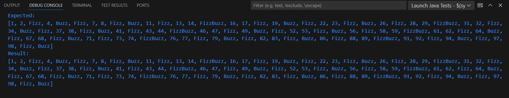
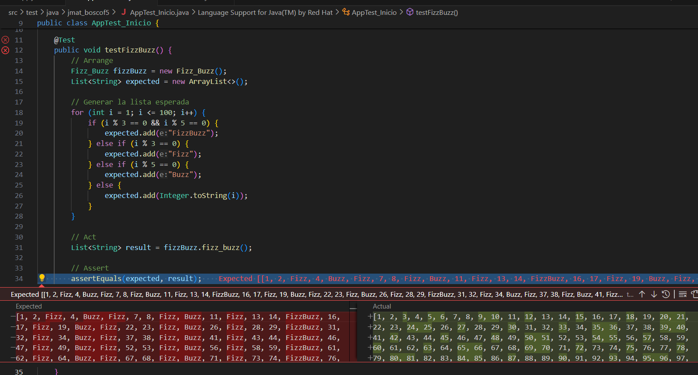

# kata Fizz_Buzz refact_jmat, ejercicio TDD

[El ejercicio consiste en realizar la Kata FizzBuzz](https://codingdojo.org/kata/FizzBuzz/)

Para resoolverlo hemos realizado un test y dos .java:

1º Fizz_Buzz con el código para que no lo pase y comprobar la dinámica del TDD.

2º FizzBuzzRefactorizado.java, con el código para que pase el Test.

3º He creado dos ramas, main con el codigo Fizz Refactorizado, y la 2º fizz_KO con el java que no pasa el test.

## REsultado Refactorizado:

## Rsultado sin TDD:

